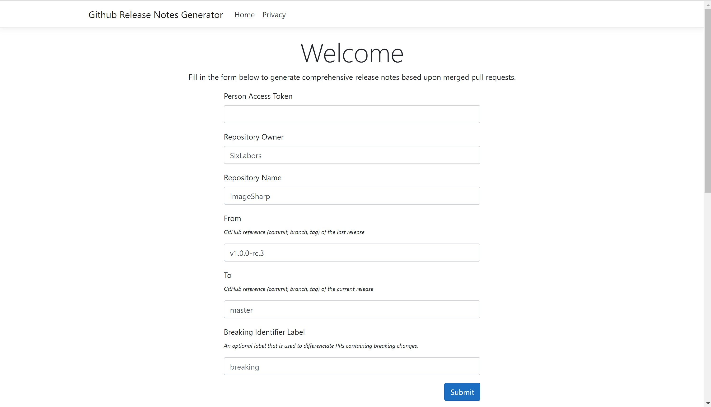
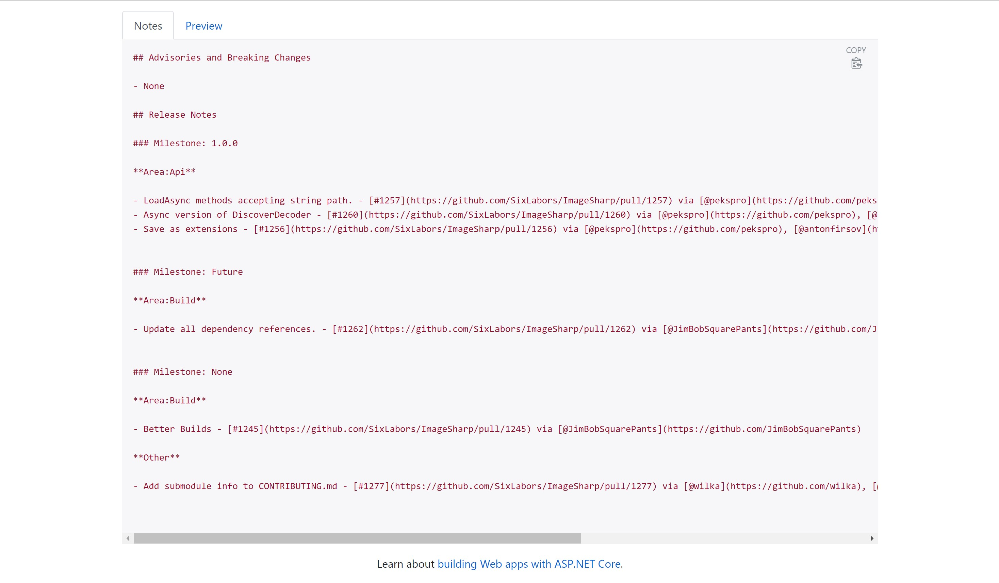
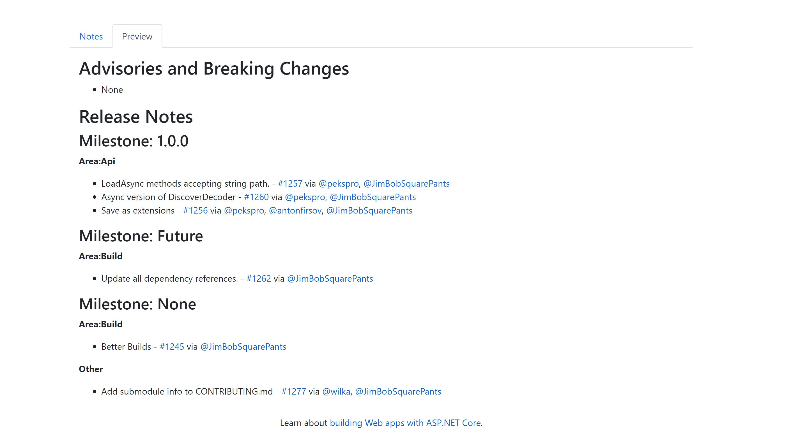

# GithubReleaseNotesGenerator

A website that allows the generation of comprehensive GitHub release notes based on merged pull requests.

https://githubreleasenotes.azurewebsites.net

### Submission Form

### Generated Output

### Markdown Preview

